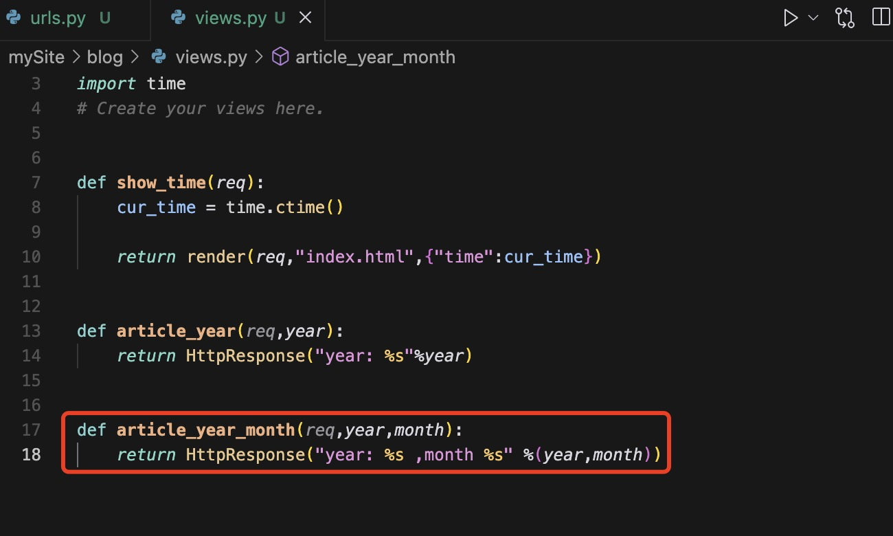

### HTTP协议

### 响应协议

响应协议的格式如下：
响应首行
响应头信息
响应体

### Web框架

框架，特指为解决一个开放性问题而设计的具有一定约束性的支撑结构，使用框架可以帮你快速开发特定的系统。

正确的做法是底层代码由专门的服务器软件实现，我们用python专注于生成html文档，因为我们不希望接触到
TCP连接、HTTP原始请求和响应格式，所以需要一个统一的接口。

## Django
Django的四部分内容：
- 路由分发
- 从数据库拿内容在前端展示
- 前段渲染
- view视图函数

### MVC和MTV模式

MVC就是把模型，控制器，视图三层，他们之间以一种插件，松耦合的方式连接在一起。

###
- 创建Django项目(创建mySite项目)
     django-admin startproject mySite
- 创建Django应用(创建blog应用)
    python manage.py startapp blog

- 启动Django服务器
    python manage.py runserver 8080

- views：实现页面
- models：创建操作数据库
- admin：管理数据库
- settings：所有的配置信息
在settings中的INSTALLED_APPS中加入创建的应用
- urls:分发视图函数，在urlpatterns中加入分发的视图
- templates: 所有的html文件（需要自己创建）

1. 首先去url中创建连接
2. 去views中写好视图函数
3. 将视图函数返回的页面放入templates中

render的作用时渲染，将后端的东西渲染到html文件中去

### 引入静态文件
1. 在settings中加入
STATICFILES_DIR = (
    os.path.join(DASE_DIR,"static"),
)

注意：通常，每一个应用下都有一个static

2. 在<html><head>中加入

3.直接通过网址引入jquery

### url控制
url配置就像Django所支撑网站的目录，其本质是URL模式以及要为该URL模式调用的视图函数
之间的映射表。

urlpatterns = [
    url(正则表达式，views视图函数，参数，别名)
]

#### 无命名分组
在urls文件中，捕获网址url中的参数，在视图views文件中，将参数获取出来，并且进行渲染

#### 命名分组

捕获网站参数的时候，需要对url的东西进行分组然后筛选出来

### url的分发

问题：现在的url全部在mysite的全局变量之中，如果应用多了，那么url会
集中在一起。
解决：将url进行分发到各自的目录下。

将部分url分发到blog.urls下

在不同目录的urls下部署不同的urls。

