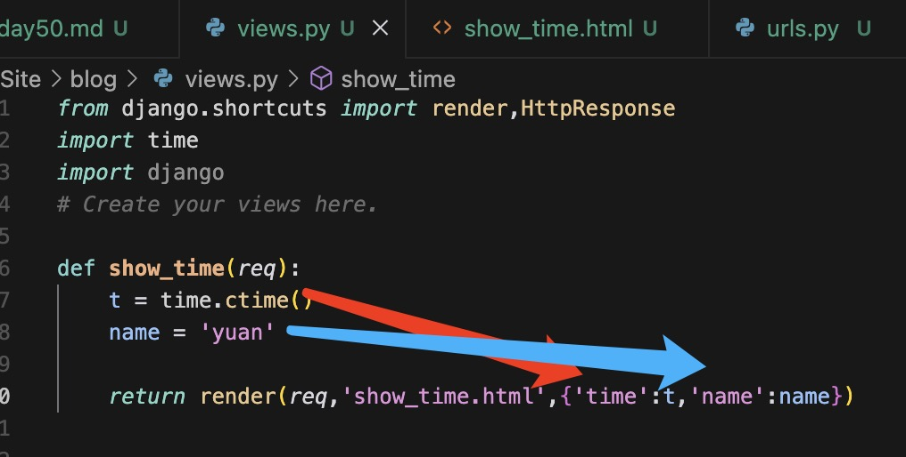
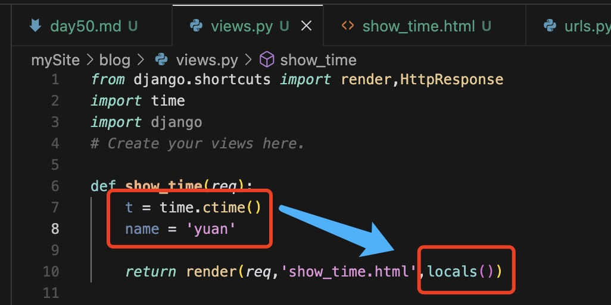
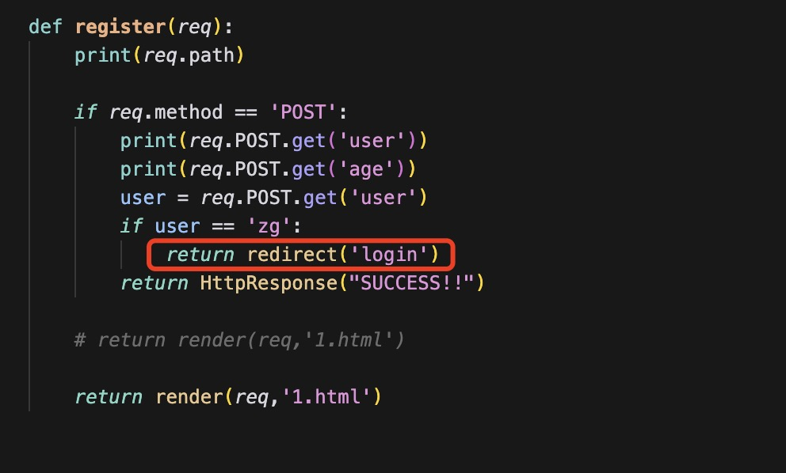
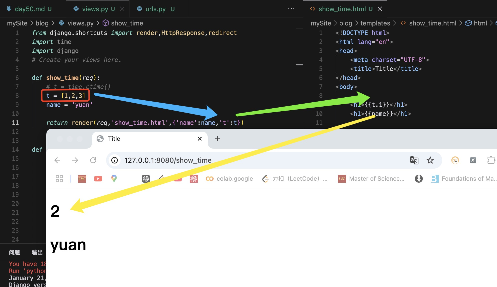
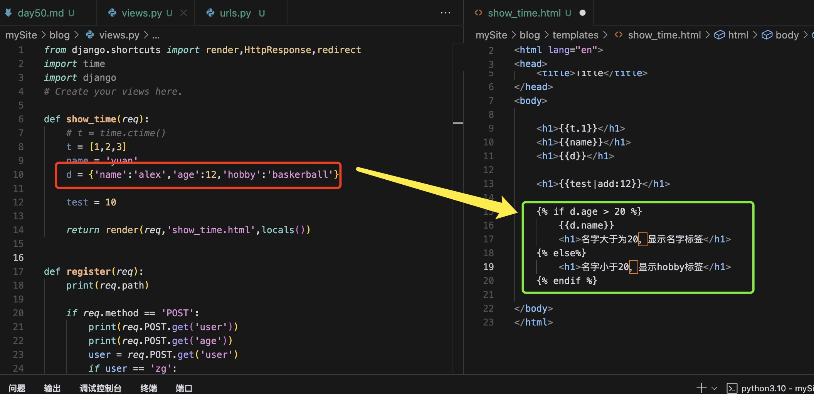
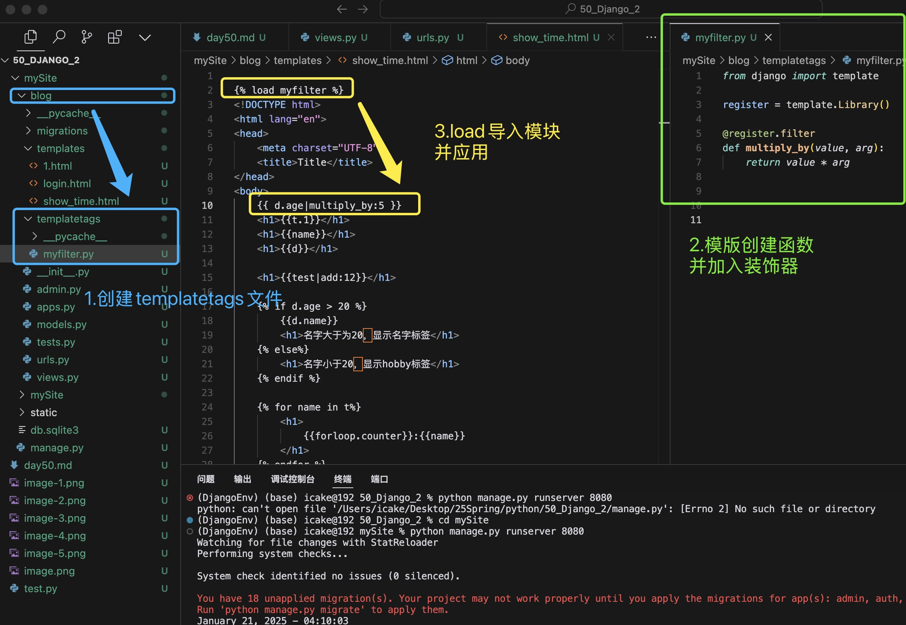
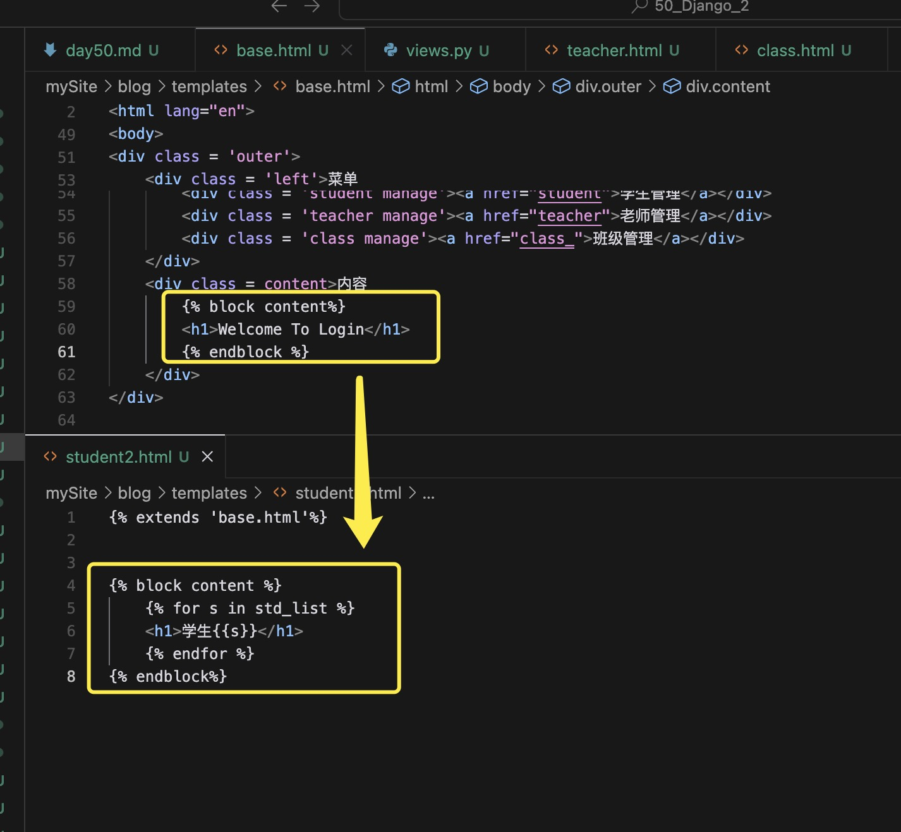
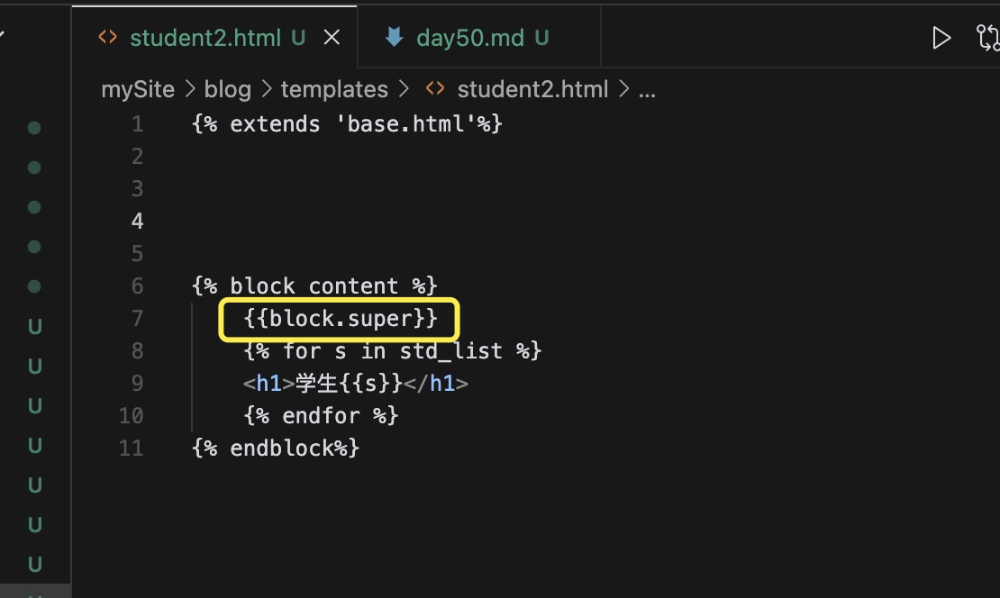

## day 50 

流程：
- django-admin startproject <项目名>
- cd <项目名>
- python manage.py startapp <应用名>
- 创建静态文件并在setting中加入静态文件 STATICFILES_DIR = ( os.path.join("BASE_DIR",'static'))
- settings中加入INSTALLED_APP
- 更改全局变量的urls
- 在应用中创建urls.py
- 在应用中创建templates文件

### req的一些属性

- req.path：链接的属性
- req.get_full_path:带着信息的属性
- req.method:请求方法

#### HTTP_RESPONSE 对象
render方法返回的是HTTP_RESPONSE对象

render(req,'1.html',context)
- req: request对象
- '1.html': html对象，一般为模版（templates）
- contxt: 上下文，渲染进html内的东西

为了方便，可以直接用locals()来代替

#### redirect() 跳转页面

redirect会走url里边的找到url，然后找到视图函数，最后渲染视图。

跳转页面和直接返回页面的区别：
直接返回页面的时候：url不会变，只会变页面，跳转的时候url就会变。
这样一个页面就不会对应一个url了。

### Template基础
对页面设计的任何改动都必须改动后端代码，而前端更改的要更多更多，因此，如果不进行后端修改
只进行前端修改会快很多。

#### 模版语法
HTML代码 + 逻辑控制代码

#### 逻辑控制代码的组成
1. 变量（使用双大括号来引用的变量）
Template 和 Context对象

        from django.template import Template,Context
        T = Template("<h1> {{name}} </h1>")
        C = Context({ "name":"alex" })  
        T.render(C)

2. 深度变量的查找，点（.）
对于列表，字典等内容，可以用.来拿到列表的索引值。

3. 变量过滤器filter的使用
语法格式：{{obj|filter:param}}

4. 标签tag的使用（大括号百分号）
语法规则：

使用标签判断语句对变量进行判断，然后进行不同的输出---

5. 在POST提交请求的时候，需要带着django的token
在POST提交之后加上
{ csrf_token %}

6. 自定义filter * 非常重要/常用
- 在app中建立templatetags文件
- 在文件中创建.py文件 写入自定义filter
- 倒入{$ load myfilter $}

第一个参数为obj，第二个参数为param，最多只能传入一个参数。

7. 自定义tag
控制语句中无法使用

### 继承
在html文件中，页面会大量的重复部分内容，而只有小部分内容会根据页面变化而变化，
基于这种问题，有了继承的概念。

在base html文件中加入块的概念，在新的html文件中加入替换的内容

.super：从父类中拿出标签信息

#### 注意
<1>如果在模板中使用{$extends$}，必须保证其为模板中的第一个模板标记。 否则，模板继承将不起作用。
<2>一般来说，基础模板中的($b1ock s}标签越多越好。 记住，子模板不必定义父模板中所有的代码块，因此你可以用合理的缺省值对一些代码块进行填充，然后只对子模板所需的代码块进行(重)定义。 俗话说，钩子越多越好。
<3>如果发觉自己在多个模板之间拷贝代码，你应该考虑将该代码段放置到父模板的某个 {tb1ock s}中。如果你需要访问父模板中的块的内容，使用{[block.super }}这个标签吧，这一个魔法变量将会表现出父模扳中的内容。 如果只想在上级代码块基础上添加内容，而不是全部重载，该变量就显得非常有用了。
<4>不允许在同一个模板中定义多个同名的(?block t}。 存在这样的限制是因为b1ock 标签的工作方式是双向的。
也就是说，b1ock标签不仅挖了一个要填的坑，也定义了在父模板中这个坑所填充的内容。如果模板中出现了两个相同名称的 {号b1ock s}标签，父模板将无从得知要使用哪个块的内容。

