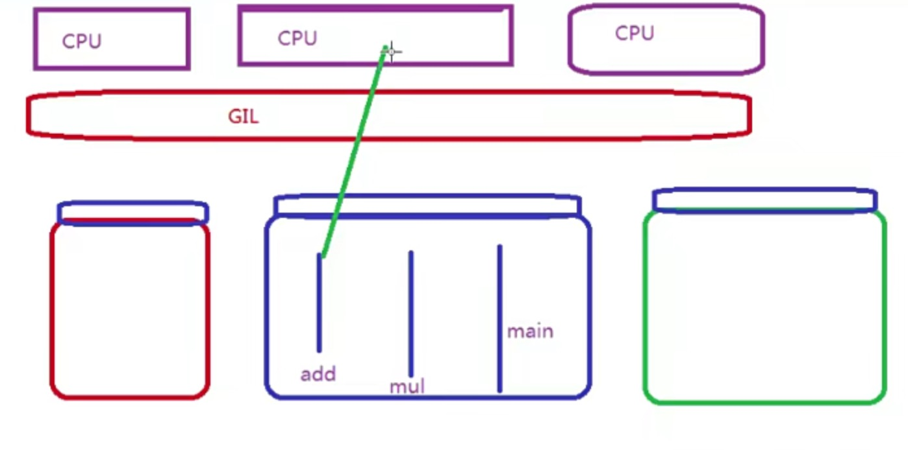

## 

### 同步锁
    l = threading.Lock()
    def sub():
        global num
        l.acquire()
        temp = num
        time.sleep(0.0001)
        num = temp - 1
        l.release()

任何语言在碰到这样的情况下，都会出现拿数据的问题，必须使用同步锁！将锁里边的代码块锁住，其他线程不能执行，改为串行执行。

### 死锁
两个线程被彼此的锁卡住，谁都无法继续前进运行。

        import threading
        import time
        class Mythtread(threading.Thread):

        def actionA(self):
            A.acquire()
            print(self.name,"got lock A",time.ctime())
            time.sleep(2)
            
            B.acquire()
            print(self.name,"got lock B",time.ctime())
            time.sleep(1)
            
            B.release()
            A.release()

        def actionB(self):
            B.acquire()
            print(self.name,"got lock B",time.ctime())
            time.sleep(2)
            
            A.acquire()
            print(self.name,"got lock A",time.ctime())
            time.sleep(1)

            A.release()
            B.release()

        def run(self):
            self.actionA()
            self.actionB()

    

    if __name__ == "__main__":
        A = threading.Lock()
        B = threading.Lock()

        list_thread = []
        for i in range(5):
            t = Mythtread()
            t.start()
            list_thread.append(t)

        for t in list_thread:
            t.join()

        print("end")
### 递归锁
递归锁内部维持了一个计数器，如果有人拿到了递归锁，就没有办法有人再次获得递归锁了。

        import threading
        import time
        class Mythtread(threading.Thread):
        def actionA(self):
            r_lock.acquire()
            print(self.name,"got lock A",time.ctime())
            time.sleep(2)
            
            r_lock.acquire()
            print(self.name,"got lock B",time.ctime())
            time.sleep(1)
            
            r_lock.release()
            r_lock.release()

        def actionB(self):
            r_lock.acquire()
            print(self.name,"got lock B",time.ctime())
            time.sleep(2)
            
            r_lock.acquire()
            print(self.name,"got lock A",time.ctime())
            time.sleep(1)

            r_lock.release()
            r_lock.release()

        def run(self):
            self.actionA()
            self.actionB()

    

    if __name__ == "__main__":
        # A = threading.Lock()
        # B = threading.Lock()

        r_lock = threading.RLock()
        list_thread = []
        for i in range(5):
            t = Mythtread()
            t.start()
            list_thread.append(t)

        for t in list_thread:
            t.join()

        print("end")
### 信号量和同步对象

#### 同步对象
让两个线程之间存在同步关系
通过event对象，将线程的先后执行顺序进行排序

    import threading,time
    class Boss(threading.Thread):
        def run(self):
            print("Boss:加班")
            print(event.is_set())
            event.set()
            time.sleep(5)
            print("Boss:下班")
            print(event.is_set())
            event.set()

    class Worker(threading.Thread):
        def run(self):
            event.wait() # 一旦event被设定，等同于pass
            print("Worker:开始工作\n")
            time.sleep(1)
            event.clear()
            event.wait()
            print("Worker:结束工作")

    if __name__ == "__main__":
        event = threading.Event()
        list_thread = []
        for i in range(5):
            t = Worker()
            list_thread.append(t)
        list_thread.append(Boss())
        for t in list_thread:
            t.start()
        for t in list_thread:
            t.join()
        print("end")

#### 信号量：
信号量用来控制线程并发数,就像一个停车场，停车场有5个车位，如果来了10辆车，那么只有5辆车可以进去，剩下的5辆车需要等待。

### 多线程利器：队列 --- 生产者消费者模型
- q.task_done() 告诉队列已经完成了动作
- q.join() 收到队列完成了
task_done() 和 join() 是成对出现的

### 进程
多进程模块 multiprocessing -- 解决GIL的问题

### 并发&并行

并发： 系统具有处理多个任务(动作)的能力

并行： 系统具有同时 处理多个任务(动作)的能力

并行是并发的子集，并行就是并发的一种，但是并发不是并行

### 同步&异步

同步：当进程执行到一个IO操作的时候（等待外部数据）的时候 就是同步
例子：打电话

异步：当进程执行到一个IO操作的时候（不等待外部数据），处理其他，等数据接收成功的时候再回来处理 就是异步
例子：发短信
异步的效率比同步的效率要高

### GIL的概念
问题：多核没利用上

GIL：global interpreter lock 全局解释器锁

无论你有多少个线程，你有多少个CPU，解释器在执行的时候，同一时间只能有一个线程在执行

垃圾回收机制：
解释器在花费一个线程来执行垃圾变量的回收

处理方法：
1. 开多个进程，分配不同的任务到不同的进程中。
2. 多进程+协程

### 任务和任务之间的不同
1. IO密集型
 存在CPU空闲时间，那么多线程就有意义了
 sleep()模拟的就是IO操作
 应该采用多进程+协程的方式

2. 计算密集型：python就不适用了
 CPU没有空闲时间，就不推荐多线程的方式

