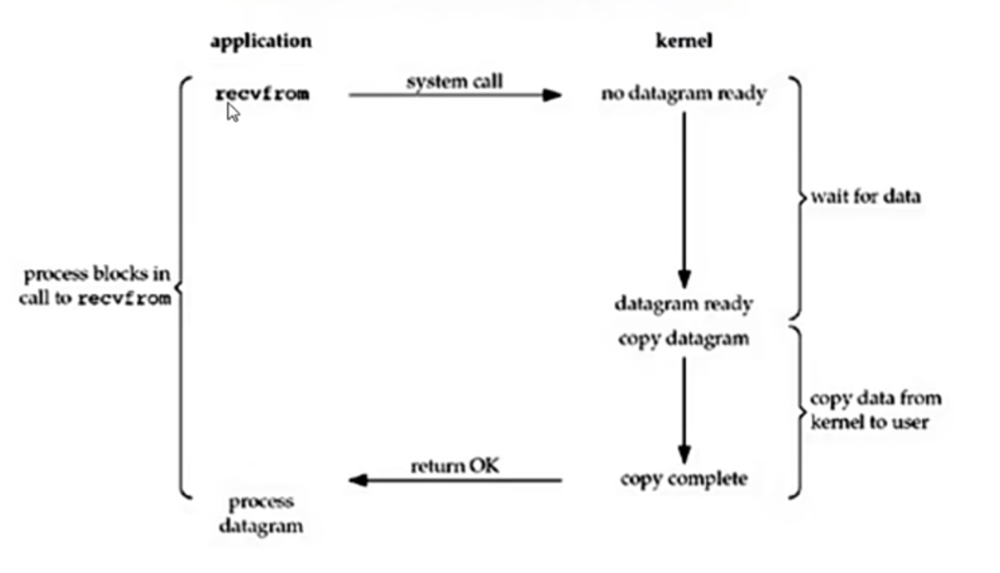
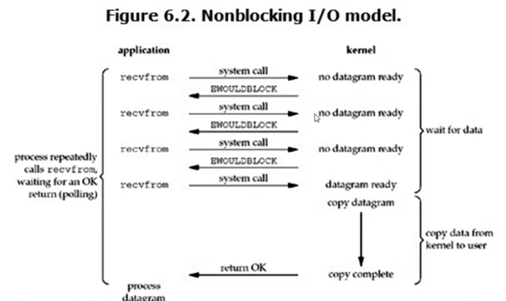
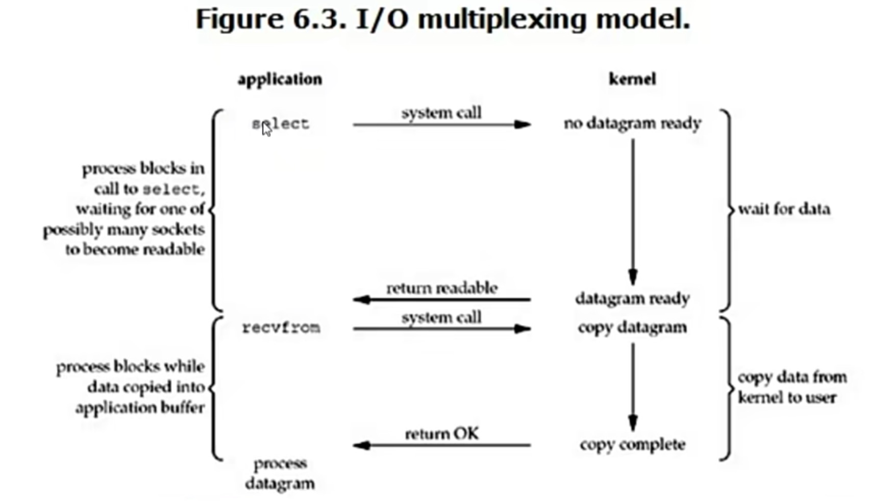

## Process 类

### Process构造方法
- group: 进程组
- target: 执行的目标任务
- name: 进程名称
- args: 给执行任务传递的参数

### 实例方法
- start(): 启动进程
- join(): 等待进程执行结束
- terminate(): 强制终止进程
- is_alive(): 判断进程是否存活

### 属性
- name: 进程名称
- pid: 进程ID
- daemon: 是否为守护进程

## 进程之间通信

### 1. 进程队列queue
进程之间的队列queue，是通过拷贝的方式进行通信的，所以说进程之间的通信非常的麻烦。

### 2. 管道
管道就是一个双向管道，通过Pipe()创建，连接两个线程，分别表示管道的两端。

### 3.Manager
Manager是进程之间的共享数据管理器，通过Manager()创建，可以创建一个共享的Manager对象，然后通过Manager对象创建一个共享的队列，然后通过队列进行进程之间的通信。

数据共享的类型
- list
- dict

## 进程同步

## 进程池
进程池文件中，出现了Foo的输出比Bar的输出慢，是因为apply_async是异步执行的：Foo函数在子进程中执行，Bar（回调函数）在主进程中执行。当Foo执行完成并返回结果后，主进程立即调用Bar。	子进程的print（Foo中的print(i)）会经过缓冲区，可能会被延迟输出。主进程的print（Bar中的print）直接输出，几乎没有延迟。

call_back的作用：当需要打印日志的时候，可以使用一个主进程去写日志，而不是用子进程去写日志。

## 协程 Coroutine
协程又称微线程，是协做式 ----非抢占的程序。

A-----> B----->A----->C

yield(协程)

是一种用户态的切换，关键点：什么时候切换！！

协程主要解决的IO操作，协程的本质就是一个线程，就没有所谓的消耗。

- 优点1:没有切换的消耗
- 优点2:没有锁的概念了，因为之前的多线程之间都是抢占式的
- 缺点1：还是无法使用多核，只能采用多进程+协程 解决问题

## 事件驱动编程思想：
    一种编程范式

传统的代码范式:A--->B--->C---->D

事件驱动模型范式：点击A---》触发A，点击B---》触发B，点击C---》触发C

实现方式：
首先有一个事件队列，每个事件对应一个动作，你触发一个动作会有一个线程把
事件放进事件队列中，然后就会有函数就回去执行。

## IO模型
### 基础内容
### 用户空间和内核空间（内核态和用户态）
操作系统的核心是内核，独立于普通的应用程序，可以访问受保护的内存空间，也能访问底层硬件设备的所有权限。
为了保证用户进程不能直接操作内核，保证内核的安全，操作系统将虚拟空间分为两部分，
一部分是内核空间，一部分是用户空间。通过CPU的指令集，来决定什么时候是内核态什么时候是用户态。

### 

### 进程切换
进程的切换非常耗资源

### 进程阻塞
正在执行的进程，由于期待的事情没有发生，进程会进入阻塞状态，阻塞之后的进程不会占用CPU资源。可见阻塞是
进程的主动行为。

### 缓存IO
传输信息必须要经过内核态，因为物理硬件的操作必须是操作系统。

### 阻塞IO

阻塞IO只发了一次系统调用，而且属于同步状态

### 非阻塞IO

sk.setblocking(False)

### IO多数复用

### 异步IO

